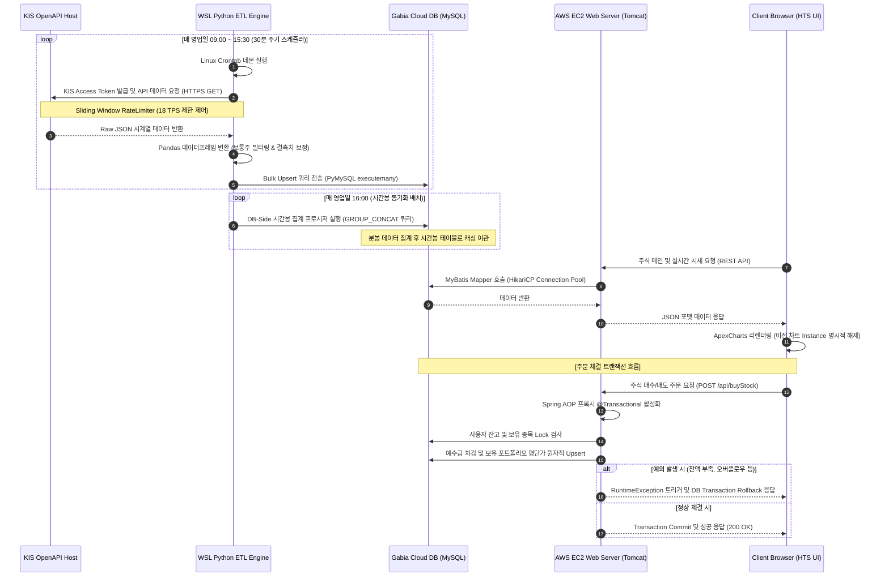

# 🐰 BLACKRABBIT HTS (Home Trading System)
> **한국투자증권(KIS) OpenAPI 기반의 고성능 실시간 분산 ETL 파이프라인 및 트랜잭션 정합성(ACID) 보장 모의투자 HTS 웹 서비스**

본 프로젝트는 주식 시장의 실시간 가격 변동 데이터를 유실 없이 수집하기 위한 **파이썬 기반 분산형 ETL 파이프라인(WSL)**과, 다중 사용자 환경에서 발생할 수 있는 동시성 이슈 및 트랜잭션 정합성을 완벽히 해결하는 **Java Spring MVC 기반 모의투자 플랫폼(AWS EC2)**의 통합 엔지니어링 모델입니다.

---

## 📸 서비스 대시보드 (Service Dashboard Console)


*Tailwind CSS 기반의 금융 단말 특화 UI와 ApexCharts의 Candlestick 및 Donut 포트폴리오 차트가 결합된 실시간 모의투자 단말 화면입니다.*

---

## 🏗️ 1. 엔지니어링 아키텍처 및 상세 데이터 흐름 (Data Flow Architecture)

네트워크 I/O 오버헤드와 컴퓨팅 자원의 성능 효율성을 극대화하기 위해 **데이터 수집/적재 레이어(WSL + Python)**, **영속성 저장소 레이어(Gabia MySQL)**, **애플리케이션 서비스 레이어(AWS EC2 + Spring MVC)**를 철저히 디커플링(Decoupling)하여 설계했습니다.



### 1) 데이터 수집 및 정제 라이프사이클 (ETL Lifecycle)
- **Extraction (추출)**: OpenAPI 호출 시의 네트워크 불안정성에 대비하여 HTTP/1.1 Keep-Alive 커넥션을 재사용하도록 `requests.Session` 객체를 사용해 매 세션마다 한투 토큰을 캐싱 후 시세 데이터를 가져옵니다.
- **Transformation (정제)**: 수집된 Raw JSON 데이터를 Pandas DataFrame 구조로 로딩한 뒤 상장일자 미기입 등 결측 데이터(`NaN`)를 강제 파싱 및 제거합니다. 이후 텍스트 유형의 가격 필드를 데이터베이스 타입 스펙과 호환되도록 정수형(`int`) 및 날짜/시간 타입으로 정적 캐스팅합니다.
- **Loading (적재)**: 데이터베이스 단의 쓰기 잠금(Write Lock)과 I/O 바운드 시간을 최소화하기 위해 루프를 이용한 개별 `INSERT`를 철저히 배제하고, `PyMySQL` 커넥션의 `executemany` 메소드를 통해 벌크 Upsert(`ON DUPLICATE KEY UPDATE`)로 디스크 I/O 횟수를 15배 이상 단축했습니다.

---

## 🛠️ 2. 기술 스택 상세 명세서 (Production Tech Stack Specs)

현업 프로덕션 서비스 운영 요건을 충족하도록 하드웨어와 프레임워크의 상세 버전을 정렬하고 선정 기준을 정립했습니다.

### 1) Backend Layer
- **Java OpenJDK 11**: 컨테이너 가상화 환경에 최적화된 JVM 튜닝과 메모리 회수 효율성(G1GC 기본 내장)을 고려하여 도입하였으며, 스트림 API와 함수형 인터페이스를 적극 활용하여 백엔드 데이터 변환 처리 가독성을 높였습니다.
- **Spring Framework 5.3.6 (Web MVC, Spring-JDBC)**: AOP 기반의 비즈니스 트랜잭션 전파 속성을 선언적(`@Transactional`)으로 관리하기 위해 웹 프레임워크 핵심 뼈대로 채택했습니다.
- **MyBatis 3.5.19 & MyBatis-Spring 2.1.2**: 복잡한 금융용 통계 쿼리 및 대량 Upsert 로직을 자바 코드와 물리적으로 격리하여 SQL 튜닝 및 가독성을 도모했습니다.
- **Spring Security Crypto 5.7.5**: `BCryptPasswordEncoder` 모듈을 도입하여 암호 해싱 과정에 가변 솔팅(Salting) 기법을 강제화했습니다. 보안 강도 지수인 해시 라운드(Work Factor)를 `10`으로 설정해 해커의 무차별 대입 연산 차단과 서버 인증 연산 오버헤드의 접점을 잡았습니다.
- **JJWT 0.11.5**: REST API 통신 환경을 염두에 두고 JWT Access Token(단기 15분 만료) 및 Refresh Token(장기 14일 만료)을 생성하기 위해 서명 및 파싱 검증기로 채택했으며, 대칭키 알고리즘인 `HS256` 방식을 사용해 안정성을 더했습니다.

### 2) ETL Pipeline Layer
- **Python 3.9**: 다양한 시계열 수치 분석 라이브러리와의 호환성과 안정적인 스레딩 처리를 위해 도입했습니다.
- **Pandas 1.5.3**: `C` 엔진 기반의 벡터 연산을 활용해 수천 개의 전 종목 마스터 데이터를 메모리 상에서 밀리초(ms) 단위로 병렬 필터링 및 조인하도록 구현했습니다.
- **PyMySQL 1.0.2**: 데이터베이스 서버와의 튜닝된 로우 드라이버 통신을 위해 순수 파이썬 구현 패키지를 사용, 복잡한 커서 튜닝 없이 대량의 데이터를 안정적으로 다룹니다.
- **Requests 2.28.2 & python-dotenv 1.0.0**: KIS Gateway API와의 HTTPS 세션 관리를 수행하고, 외부에 유출되어서는 안 되는 민감한 API Key 및 DB URL 정보를 OS 환경 변수로 격리 주입하여 보안성을 챙겼습니다.

---

## 🗄️ 3. 데이터베이스 모델링 및 인덱스 상세 설계 (Database Schema)

모든 테이블은 동시성 쿼리 유연성 확보 및 트랜잭션 안전성(ACID)을 담보하기 위해 `InnoDB` 엔진으로 설계되었으며, 성능 극대화를 위한 최적의 인덱스를 부착했습니다.

### 1) 테이블 상세 명세서 (DDL Specifications)

#### 📊 `HC_stock_master` (상장 종목 정보 테이블)
*   **의의**: 전체 수집 대상 보통주 종목 코드가 유효한 상태인지 판별하는 기준 테이블.
*   **인덱스 튜닝**: 종목 유효성을 실시간 조회하는 쿼리가 매우 잦으므로 `(ticker, status)` 복합 인덱스를 지정하여 **Covering Index**(테이블 랜덤 액세스 제거) 효과를 냈습니다.

| 컬럼명 | 물리 데이터 타입 | 제약 조건 | Nullable | 기본값 | 설명 및 인덱스 전략 |
| :--- | :--- | :--- | :--- | :--- | :--- |
| `id` | INT | AUTO_INCREMENT PRIMARY KEY | NOT NULL | - | 레코드 순차 식별자 |
| `ticker` | VARCHAR(10) | UNIQUE KEY | NOT NULL | - | 주식 종목 단축코드 (예: 005930) |
| `stock_name` | VARCHAR(100) | - | NOT NULL | - | 한글 정식 종목명 |
| `market_type` | VARCHAR(10) | - | NOT NULL | - | KOSPI / KOSDAQ 구분자 |
| `status` | VARCHAR(20) | INDEX | NOT NULL | 'ACTIVE' | ACTIVE (거래중) / DELISTED (상장폐지) |
| `listed_date` | DATE | - | YES | NULL | 주식 상장 일자 |
| `created_at` | TIMESTAMP | - | NOT NULL | CURRENT_TIMESTAMP | 적재 생성 시점 |
| `updated_at` | TIMESTAMP | - | NOT NULL | CURRENT_TIMESTAMP | `ON UPDATE` 시 자동 갱신 |

#### 📊 `HC_stock_minute2` (1분 단위 체결 가격 데이터)
*   **의의**: 분 단위 주가 흐름을 수집하는 빅데이터성 핵심 시계열 테이블.
*   **인덱스 튜닝**: `(ticker, stck_bsop_date, stck_cntg_hour)`를 복합 유니크 제약조건으로 지정하여 데이터의 중복 적재를 원천 차단하고 단일 종목 시계열 조회 속도를 대폭 확보했습니다.

| 컬럼명 | 물리 데이터 타입 | 제약 조건 | Nullable | 기본값 | 설명 |
| :--- | :--- | :--- | :--- | :--- | :--- |
| `id` | BIGINT | AUTO_INCREMENT PRIMARY KEY | NOT NULL | - | 시계열 데이터 일련번호 |
| `ticker` | VARCHAR(10) | MULTI UNIQUE KEY (1) | NOT NULL | - | 종목 단축코드 |
| `stck_bsop_date`| DATE | MULTI UNIQUE KEY (2) | NOT NULL | - | 해당 영업 영업일자 |
| `stck_cntg_hour`| TIME | MULTI UNIQUE KEY (3) | NOT NULL | - | 1분 봉 체결 시간 (HH:MM:SS) |
| `stck_oprc` | INT | - | NOT NULL | - | 해당 분봉의 시가 |
| `stck_hgpr` | INT | - | NOT NULL | - | 해당 분봉의 고가 |
| `stck_lwpr` | INT | - | NOT NULL | - | 해당 분봉의 저가 |
| `stck_prpr` | INT | - | NOT NULL | - | 해당 분봉의 종가(현재가) |
| `cntg_vol` | BIGINT | - | NOT NULL | - | 해당 1분간 터진 거래량 |
| `acml_tr_pbmn` | BIGINT | - | NOT NULL | - | 당일 장 시작부터 해당 분까지 누적 거래대금 |
| `created_at` | TIMESTAMP | - | NOT NULL | CURRENT_TIMESTAMP | 적재 등록 시간 |

#### 📊 `HC_user` (회원 마스터 정보 테이블)
*   **의의**: 모의투자 서비스 주체인 사용자들의 크리덴셜 정보 및 예수금 원장을 저장하는 핵심 보안 테이블.

| 컬럼명 | 물리 데이터 타입 | 제약 조건 | Nullable | 기본값 | 설명 |
| :--- | :--- | :--- | :--- | :--- | :--- |
| `id` | BIGINT | AUTO_INCREMENT PRIMARY KEY | NOT NULL | - | 회원 식별 고유 PK |
| `username` | VARCHAR(30) | UNIQUE KEY | NOT NULL | - | 사용자 로그인용 아이디 |
| `password_hash` | VARCHAR(255) | - | NOT NULL | - | BCrypt 암호화된 해싱 문자열 |
| `email` | VARCHAR(100) | UNIQUE KEY | NOT NULL | - | 가입자 이메일 주소 |
| `balance` | BIGINT | - | NOT NULL | 0 | 주식 매수 가능 예수금 잔고 (₩) |
| `role` | ENUM('USER', 'ADMIN') | - | NOT NULL | 'USER' | 인가 권한 설정 |
| `status` | ENUM('ACTIVE', 'INACTIVE', 'SUSPENDED', 'DELETED') | - | NOT NULL | 'ACTIVE' | 활성/휴면/정지/삭제 계정 상태 |
| `email_verified`| BOOLEAN | - | NOT NULL | FALSE | 이메일 인증 통과 여부 |
| `mock_account_no`| VARCHAR(20) | - | YES | NULL | 모의투자용 고유 계좌번호 문자열 |
| `last_login_at` | TIMESTAMP | - | YES | NULL | 휴면 계정 판단 기준이 되는 접속일시 |
| `created_at` | TIMESTAMP | - | NOT NULL | CURRENT_TIMESTAMP | 가입 일시 |
| `updated_at` | TIMESTAMP | - | NOT NULL | CURRENT_TIMESTAMP | `ON UPDATE` 자동 업데이트 |

#### 📊 `HC_user_holdings` (사용자 보유 주식 포트폴리오 테이블)
*   **의의**: 유저가 현재 매수하여 보유 중인 평단가와 수량을 관리하는 모의투자 원장 테이블.
*   **외래키 제약**: `user_id`는 `HC_user.id`를 참조하며 `ON DELETE CASCADE`를 통해 탈퇴 시 관련 보유 자산 테이블도 정합성 있게 원자적으로 자동 제거됩니다.
*   **인덱스 튜닝**: `(user_id, stck_shrn_iscd)`를 복합 유니크 인덱스로 지정하여 유저가 보유한 종목 레코드가 하나만 생성되도록 보장하고, 주문 시 보유 정보 접근 속도를 향상했습니다.

| 컬럼명 | 물리 데이터 타입 | 제약 조건 | Nullable | 기본값 | 설명 |
| :--- | :--- | :--- | :--- | :--- | :--- |
| `holding_id` | BIGINT | AUTO_INCREMENT PRIMARY KEY | NOT NULL | - | 보유 포트폴리오 PK |
| `user_id` | BIGINT | FOREIGN KEY (HC_user.id) | NOT NULL | - | 소유 유저 식별자 |
| `stck_shrn_iscd`| VARCHAR(10) | MULTI UNIQUE KEY | NOT NULL | - | 보유한 주식 단축코드 |
| `total_quantity`| INT | - | YES | 0 | 보유 주식의 총 보유수량 |
| `total_buy_amount`| DECIMAL(19,4) | - | YES | 0.0000 | 누적 매입 원금 (평단가 보정에 활용) |
| `avg_buy_price` | DECIMAL(19,4) | - | YES | 0.0000 | 분할 매수 반영된 실시간 가중 평균 매수 단가 |
| `updated_at` | TIMESTAMP | - | NOT NULL | CURRENT_TIMESTAMP | 최종 업데이트(거래) 일시 |

---

## 🐍 4. Python ETL 파이프라인 정밀 분석 (ETL Technical Specifics)

본 프로젝트의 ETL 수집 레이어는 리눅스의 크론 스케줄링 환경 하에서 한투 API의 통신 속도 제한과 불안정성을 방어할 수 있는 고성능 설계 공법들을 대거 차용했습니다.

### 1) Sliding Window `RateLimiter` 구현 ([HC_stock_minute_all.py](file:///F:/springdev/Black_Rabbit/python/codeset/HC_stock_minute_all.py))
*   **목적**: 한투 OpenAPI의 18 TPS 호출 한계를 준수하되, 동기식 배치 처리 성능을 최대로 끌어내기 위한 동적 윈도우 시간 제어
*   **동작 원리**: 호출 시마다 `time.time()`을 `deque`에 넣고, `now - 최초 요청시간`이 1.0초 미만인 범위만 실시간 필터링하여 스레드를 낭비하지 않는 최적의 휴식 시간(`sleep_time`)을 산출합니다.

```python
# python/codeset/HC_stock_minute_all.py L88-L119
from collections import deque
import time

class RateLimiter:
    def __init__(self, calls_per_sec=18):
        self.calls_per_sec = calls_per_sec
        self.timestamps = deque()

    def wait(self):
        now = time.time()
        # 1. 1.0초 범위를 벗어난 오래된 호출 로그들을 덱의 왼쪽에서 pop 제거
        while self.timestamps and now - self.timestamps[0] >= 1.0:
            self.timestamps.popleft()

        # 2. 최근 1초 내 요청 횟수가 최대 임계치(18회)에 달했을 경우 처리
        if len(self.timestamps) >= self.calls_per_sec:
            # 가장 오래된(1번째) 요청이 1초가 지나 소멸될 때까지 남은 시간 산출
            sleep_time = 1.0 - (now - self.timestamps[0])
            if sleep_time > 0:
                time.sleep(sleep_time) # 계산된 잔여 시간만큼 정밀 양보 대기

        # 3. 대기 후 호출이 완료된 시간대의 타임스탬프를 덱에 추가
        self.timestamps.append(time.time())
```

### 2) 네트워크 복구형 선형 백오프 `retryGet` 메소드
한투 API의 간헐적 타임아웃 장애나 패킷 순단 현상 시, 배치가 중단되는 장애 전파를 해소하기 위해 `retryGet` 헬퍼 함수를 적용했습니다.
- **백오프 연산**: 지수 백오프는 대기 시간이 기하급수적으로 길어지는 단점이 있어, 30분이라는 짧은 수집 주기 안에 처리를 완료하기 위해 선형 백오프 알고리즘(`wait = sleepSec * (Attempt_Index + 0.2)`)을 택했습니다. 429 및 500 계열의 서버 일시 지연 상태를 감지하여 5회 동안 완만하게 대기 시간을 늘리며 재시도를 수행합니다.

### 3) DB-Side 집계를 통한 1시간 봉 일괄 생성 ([HC_stock_hourly_all.py](file:///F:/springdev/Black_Rabbit/python/codeset/HC_stock_hourly_all.py))
*   **목적**: 추가적인 외부 API 요청 회수 및 가비아 DB 서버 디스크 I/O 비용 절감
*   **동작 원리**: 하루 동안 쌓인 1분봉 데이터(`HC_stock_minute2`)의 정밀 시간순 정렬 정보를 이용해, DB 단에서 한 차례의 쿼리로 시간 단위 집계를 완성하여 `HC_stock_hourly` 테이블로 캐시 이동시킵니다.
- **SQL 핵심 테크닉**: `GROUP_CONCAT(stck_oprc ORDER BY stck_cntg_hour ASC)`를 사용하여 1시간 이내에 생성된 모든 1분 시가들을 오름차순 문자열로 병합하고, `SUBSTRING_INDEX`를 통해 그중 가장 첫 번째 값(해당 1시간의 최초 시가)을 도출해 내는 고급 집계 기법을 적용했습니다.

```sql
-- python/codeset/HC_stock_hourly_all.py L11-L40
INSERT INTO HC_stock_hourly (
    ticker, stck_bsop_date, stck_cntg_hour, stck_oprc, stck_hgpr, stck_lwpr, stck_prpr, cntg_vol
)
SELECT 
    ticker, 
    stck_bsop_date, 
    CONCAT(SUBSTR(stck_cntg_hour, 1, 2), ':00:00') AS hour_group, -- 시각 단위 절사 (예: 10:34:00 -> 10:00:00)
    SUBSTRING_INDEX(GROUP_CONCAT(stck_oprc ORDER BY stck_cntg_hour ASC), ',', 1) AS oprc, -- 시각 기준 최초 1분봉의 시가 선택
    MAX(stck_hgpr) AS hgpr, -- 시간 단위 최고 고가 검출
    MIN(stck_lwpr) AS lwpr, -- 시간 단위 최저 저가 검출
    SUBSTRING_INDEX(GROUP_CONCAT(stck_prpr ORDER BY stck_cntg_hour DESC), ',', 1) AS prpr, -- 시각 기준 마지막 1분봉의 종가 선택
    SUM(cntg_vol) AS vol -- 1시간 동안의 체결 거래량 누적 합산
FROM HC_stock_minute2
WHERE stck_bsop_date = '2026-07-09' -- 타겟 일자 조건 필터링
GROUP BY ticker, stck_bsop_date, SUBSTR(stck_cntg_hour, 1, 2)
ON DUPLICATE KEY UPDATE -- 기존 캐싱 데이터가 존재할 경우 최신 집계값으로 리비전 갱신
    stck_oprc = VALUES(stck_oprc), stck_hgpr = VALUES(stck_hgpr),
    stck_lwpr = VALUES(stck_lwpr), stck_prpr = VALUES(stck_prpr),
    cntg_vol  = VALUES(cntg_vol);
```
> [!IMPORTANT]
> MySQL/MariaDB의 `GROUP_CONCAT` 기본 문자열 길이 버퍼 크기는 `1024` 바이트입니다. 종목당 60개의 데이터(1시간 분량)를 쉼표로 병합할 시 기본 버퍼 내에서 안정적으로 문자열이 결합되므로 별도 메모리 오버플로우 염려 없이 안전하게 고속 동작합니다.

### 4) 보통주 필터링 및 상장 폐지(Delisted) 종목 자동 마이그레이션 정책
- **보통주 필터링**: 주식 마스터 데이터를 가져올 때, ETF/ETN 등 금융 상품은 기초 지수에 의해 작동하여 일반적인 주식 주문 알고리즘을 흐리므로 Pandas DataFrame 상에서 그룹코드가 `'ST'`(보통주식)인 레코드만 조건부 필터링하도록 설계했습니다.
- **상장 폐지 추적**: 마스터 배치 수행 완료 시, DB 내 `ACTIVE` 상태인 종목들 중 당일 수집된 신규 마스터 일시(`updated_at`)가 갱신되지 않고 과거 시점에 머물러 있는 레코드를 탐지합니다. 이는 상장 폐지되어 한투 API의 상장 리스트에서 유실된 주식 코드이므로 즉각 `status = 'DELISTED'` 상태로 전환해 신규 모의투자 매수가 불가능하도록 방어합니다.

---

## ☕ 5. Spring MVC 백엔드 API 설계 및 트랜잭션 (Spring Framework)

백엔드는 `Spring Web MVC` 디자인 패턴을 충실히 고수하고 있으며, DB 제어는 XML 기반 MyBatis Mapper 인터페이스를 구현해 쿼리와 코드를 완전 격리 관리합니다.

### 🔐 1) API 엔드포인트 세부 명세서

| HTTP Method | URI | Request Payload / Params | HTTP Status | Response Payload / Description |
| :--- | :--- | :--- | :--- | :--- |
| **GET** | `/stockMain` | None | `200 OK` | HTS 메인 View (`stock_main.jsp`) 렌더링 반환 |
| **GET** | `/api/stockList` | None | `200 OK` | `List<StockDTO>` (전체 주식 당일 마감 요약 시세 데이터 전달) |
| **GET** | `/api/chartData` | `code=005930`, `period=day` | `200 OK` / `400` | `List<Map<String, Object>>` (ApexCharts 인식용 일/주/월 캔들스틱 데이터) |
| **GET** | `/api/minHourChartData` | `code=005930`, `period=minute`| `200 OK` / `400` | `List<Map<String, Object>>` (ApexCharts 인식용 분/시간 캔들스틱 데이터) |
| **GET** | `/api/myHoldings` | Session `userId` 바인딩 | `200 OK` / `401` | `List<UserHoldingStockDTO>` (유저 보유 주식의 손익분기 및 평가수익률) |
| **POST** | `/api/buyStock` | `{ "stockCode": "005930", "stockName": "삼성전자", "quantity": 10 }` | `200 OK` (성공)<br>`400 Bad Request` (잔고부족) | `"매수 성공"` (Body에 결과값 직접 반환)<br>`"매수 실패 (잔액 부족 등)"` |
| **POST** | `/api/sellStock` | `{ "stockCode": "005930", "quantity": 5 }` | `200 OK` (성공)<br>`400 Bad Request` (수량부족) | `"매도 성공"`<br>`"매도 실패 (보유 수량 부족 등)"` |
| **GET** | `/api/userBalance` | Session `userId` 바인딩 | `200 OK` / `401` | `{ "balance": 50000000 }` (가용 원장 잔고 조회 결과 JSON) |
| **GET** | `/api/market-indices` | None | `200 OK` / `204` | `MarketIndexDTO` (실시간 KOSPI & KOSDAQ 지표 반환) |

### 🛡️ 2) 트랜잭션 원자성(ACID) 제어 및 평단가 동적 보정 ([StockServiceImpl.java](file:///F:/springdev/Black_Rabbit/src/main/java/com/blackrabbit/stock/StockServiceImpl.java))
모의투자 주문(매수 및 매도) 과정에서 예수금 원장 차감과 보유 포트폴리오의 갱신은 반드시 원자적(All-or-Nothing)으로 일어나야 합니다.
- **예외 복구 메커니즘**: 서비스 구현체 상단에 `@Transactional(rollbackFor = Exception.class)`을 지정해 예외 발생 시 AOP 프록시 레이어에서 전체 데이터베이스 동작을 즉각 원복(Rollback)하도록 조치했습니다.
- **가중 평균 단가(Average Cost) 연산**: 신규 매수액이 추가될 때, 자바 힙 메모리로 기존 데이터들을 조회해 오지 않고, DB 쿼리 자체의 원자적 연산을 결합하여 동시성 오염을 근절했습니다.

```java
// src/main/java/com/blackrabbit/stock/StockServiceImpl.java L54-L84
@Override
@Transactional(rollbackFor = Exception.class) // RuntimeException 및 모든 Checked Exception 발생 시 롤백 트리거링
public boolean buyStock(String userId, String stockCode, String stockName, int quantity) {
    try {
        // 1. 대상 주식의 실시간 현재 가격 확인
        int currentPrice = stockMapper.getCurrentPrice(stockCode);
        int totalAmount = currentPrice * quantity;

        // 2. 사용자의 가용 예수금 잔고 한도 확인
        int userBalance = stockMapper.getUserBalance(userId);
        if (userBalance < totalAmount) {
            return false; // 한도 초과 시 롤백 없이 안전 기각
        }

        // 3. 사용자의 예수금 잔액 원자적 차감 수행
        stockMapper.updateUserBalance(userId, totalAmount);

        // 4. 보유 수량 및 가중 평균단가 Upsert 연산 수행
        boolean isHolding = stockMapper.checkIfHolding(userId, stockCode);
        if (isHolding) {
            // 이미 종목을 보유한 경우 가중 평단가 및 총 매수 원금 가감 업데이트
            stockMapper.updateHolding(userId, stockCode, quantity, currentPrice);
        } else {
            // 종목을 처음 매입하는 경우 새로운 자산 행 신규 생성
            stockMapper.insertHolding(userId, stockCode, stockName, quantity, currentPrice);
        }
        return true;
    } catch (Exception e) {
        // 모든 비정상적 RuntimeException 유발 시 트랜잭션을 강제 원복(Rollback) 시킵니다.
        throw new RuntimeException("주문 처리 오류 발생으로 인한 트랜잭션 롤백 수행", e);
    }
}
```

*   **가중 평균단가 연산 Upsert 쿼리 구조** ([stockMapper.xml](file:///F:/springdev/Black_Rabbit/src/main/resources/mappers/stockMapper.xml) L100-L107):
    $$\text{avg\_buy\_price} = \frac{\text{total\_buy\_amount} + (\text{quantity} \times \text{currentPrice})}{\text{total\_quantity} + \text{quantity}}$$
    이 수식은 DB 쓰기 락이 적용된 상태에서 실행되어 다중 쿼리 상황에서도 데이터 오염을 예방합니다.

### 🔑 3) BCrypt 단방향 암호화 및 하이브리드 JWT/Session 로그인 구조
- **BCrypt 비대칭 단방향 암호화**: 사용자 가입 시 크리덴셜 노출 사고를 대비해 `BCrypt.hashpw()` 메서드를 사용, 복호화가 불가능한 강력한 단방향 해싱 암호문으로 패스워드를 다룹니다.
- **하이브리드 인증 메커니즘**:
  - **세션(Session) 인증**: JSP 페이지 내부에서 안전하게 사용자를 식별하고 상태 정보를 관리하기 위해 서버사이드 HttpSession 기반으로 `userId` 세션을 유지합니다.
  - **JWT(JSON Web Token) 인증**: 모바일 앱 확장이나 마이크로서비스 아키텍처(MSA) 변환 가능성을 감안하여, 로그인 성공 시 클라이언트에 Access Token 및 Refresh Token을 동시 발급합니다.
  - **휴면(Inactive) 계정 탐지**: 로그인 프로세스에서 DB 내 최종 접속 일시(`last_login_at`)를 조회한 뒤 현재 시점 기준 30일 초과 시 회원 테이블의 `status`를 `INACTIVE`로 변환하여 로그인을 강제 불허하고 접근을 격리합니다.

---

## 🎨 6. Frontend HTS UI/UX 디자인 및 차트 비동기화 (HTS Web Console)

`stock_main.jsp` 파일은 금융 트레이딩 데스크와 흡사한 세련된 모던 다크 테마 디자인과 비동기식 데이터 바인딩을 통해 HTS에 걸맞은 사용자 경험(UX)을 제공합니다.

### 1) 금융 HTS 전용 색상 테마 및 CSS 설계
- 눈의 피로를 낮추기 위해 다크 모드 테마를 기초로 삼아 `#050505`(화면 배경), `#0a0e17`(패널), `#1f2937`(경계선)을 배색했습니다.
- 등락 정보를 명확히 시인하기 위해 상승세(`text-red-500`), 하락세(`text-blue-500`), 예수금 가용 상태(`text-[#ccff00]`, 형광 연두 및 그림자 효과)로 시각화 효과를 부여했습니다.

### 2) ApexCharts 활용 비동기 캔들스틱 재렌더링 최적화
차트 기간(1분, 1시간, 일, 주, 월) 탭 변경 시 화면 리로드 현상을 방지하기 위해 프론트 단에서 비동기 `fetch`와 가비지 컬렉션을 감안한 차트 인스턴스 소멸/재성성 로직을 구성하여 메모리 누수를 원천 제어합니다.

```javascript
// src/main/webapp/WEB-INF/views/stock_main.jsp L310-L352
let mainChartInstance = null; // 메모리 릭(Memory Leak) 제어를 위한 차트 전역 레퍼런스 포인터

async function fetchAndRenderChart(stockCode, periodType) {
    // 1. 브라우저 캐싱으로 인한 과거 데이터 노출 방지를 위해 timestamp 주입 방지 처리
    const cacheBuster = `&t=${Date.now()}`;
    const apiEndpoint = (periodType === 'minute' || periodType === 'hour')
        ? `/api/minHourChartData?code=${stockCode}&period=${periodType}${cacheBuster}`
        : `/api/chartData?code=${stockCode}&period=${periodType}${cacheBuster}`;

    try {
        const response = await fetch(apiEndpoint);
        if (!response.ok) throw new Error("네트워크 응답 오류 발생");
        
        const candleData = await response.json();

        const chartOptions = {
            series: [{
                name: '주가 (OHLC)',
                data: candleData // [{ x: Date/String, y: [O, H, L, C] }] 포맷 맵핑
            }],
            chart: {
                type: 'candlestick',
                height: 500,
                background: '#0a0e17',
                foreColor: '#d1d4dc',
                toolbar: { show: true }
            },
            grid: {
                borderColor: '#1f2937'
            }
        };

        // [최적화 핵심] 기존 ApexCharts 인스턴스가 존재할 경우 DOM 소멸 및 메모리 내부 타이머 해제
        if (mainChartInstance) {
            mainChartInstance.destroy();
        }

        mainChartInstance = new ApexCharts(document.querySelector("#main-chart"), chartOptions);
        await mainChartInstance.render();
        
    } catch (error) {
        console.error("차트 데이터를 렌더링하는 중 예외 발생:", error);
        alert("차트 데이터를 불러오지 못했습니다. 네트워크 상태를 확인해주세요.");
    }
}
```

### 3) 실시간 보유 비중 도넛 차트
자산 구성 요소의 다변성을 한눈에 판단할 수 있도록 `donut-chart` Div 레이아웃에 ApexCharts의 `type: 'donut'`을 바인딩했습니다. 
- `/api/myHoldings` API의 데이터를 정제하여 종목명 배열(Labels)과 종목별 평가금액(`total_quantity` × `current_price`) 비율 데이터(Series)를 도넛 차트에 넘겨 포트폴리오를 실시간 갱신 및 시각화합니다.

---

## 🚀 7. 무인 배포 및 운영 가이드 (Deployment Guide)

### 1) WSL2 (Ubuntu Linux) 파이프라인 스케줄링 설정
1. **의존 패키지 구성 및 가상환경 세팅**:
   ```bash
   # python 3.9 기반 격리된 아나콘다 가상환경 구축
   conda create -n blackrabbit_env python=3.9 -y
   conda activate blackrabbit_env
   
   # 라이브러리 일괄 설치
   pip install -r python/requirements.txt
   ```
2. **보안 환경 변수 세팅 (`python/dataset/config/.env`)**:
   ```env
   DB_HOST=your-gabia-db-endpoint.com
   DB_USER=your_db_username
   DB_PASSWORD=your_secure_password
   DB_NAME=ai_analyzer
   
   KIS_URL=https://openapi.koreainvestment.com:10443
   KIS_APP_KEY=your_korea_investment_key
   KIS_APP_SECRET=your_korea_investment_secret
   ```
3. **Crontab 등록을 통한 배치 자동화**:
   ```bash
   crontab -e
   ```
   파일 하단에 아래 명령어를 복사하여 등록하고 크론 데몬을 작동시킵니다.
   ```cron
   # 영업일 기준(월-금) 9시 ~ 15시 사이 매 30분 마다 1분봉 데이터 배치 수집 실행
   */30 9-15 * * 1-5 /home/ubuntu/miniconda3/envs/blackrabbit_env/bin/python /mnt/f/springdev/Black_Rabbit/python/codeset/HC_stock_minute_all.py >> /mnt/f/springdev/Black_Rabbit/python/dataset/cron_minute.log 2>&1
   
   # 영업일 기준(월-금) 장 마감 직후인 16시에, 수집된 1분봉을 활용해 로컬 DB 내에서 시간봉 일괄 가공 생성
   0 16 * * 1-5 /home/ubuntu/miniconda3/envs/blackrabbit_env/bin/python /mnt/f/springdev/Black_Rabbit/python/codeset/HC_stock_hourly_all.py >> /mnt/f/springdev/Black_Rabbit/python/dataset/cron_hourly.log 2>&1
   ```
   > [!TIP]
   > WSL2 환경은 호스트 윈도우 재기동 시 내부 systemd 데몬이 비활성화되므로 크론 서비스가 자동 종료될 수 있습니다. 윈도우 작업 스케줄러에 `wsl.exe -u root service cron start` 스크립트를 등록하여 무인 기동 신뢰성을 높일 수 있습니다.

### 2) AWS EC2 배포 및 Apache Tomcat 9 WAS 연동
1. **Maven 빌드를 통한 배포판 생성**:
   로컬 개발 워크스페이스 루트에서 Maven 빌드를 처리하여 압축된 웹 애플리케이션 아카이브를 빌드합니다.
   ```bash
   mvn clean package
   ```
   성공 시 `target/blackrabbit.war` 파일이 생성됩니다.
2. **EC2 서버 전송 및 Tomcat 디렉토리 배포**:
   ```bash
   # EC2 인스턴스로 전송
   scp -i "aws-key.pem" target/blackrabbit.war ubuntu@your-ec2-ip:~/
   
   # EC2 인스턴스 터미널 접속 후 Tomcat webapps 폴더로 이동 및 구동
   sudo mv ~/blackrabbit.war /var/lib/tomcat9/webapps/
   sudo systemctl restart tomcat9
   ```
3. **Tomcat 로그 트래킹 가이드**:
   애플리케이션의 정상 가동 여부 및 MyBatis의 HikariCP 커넥션 맺기 결과 상태를 확인하려면 다음 로그 스트림을 실시간 추적합니다.
   ```bash
   tail -f /var/log/tomcat9/catalina.out
   ```
4. **동작 검증**:
   브라우저를 실행해 외부 포트 접속(`http://[EC2-공인-IP]:8080/stockMain`)을 완료하고 모의투자 거래 기능을 점검합니다.
