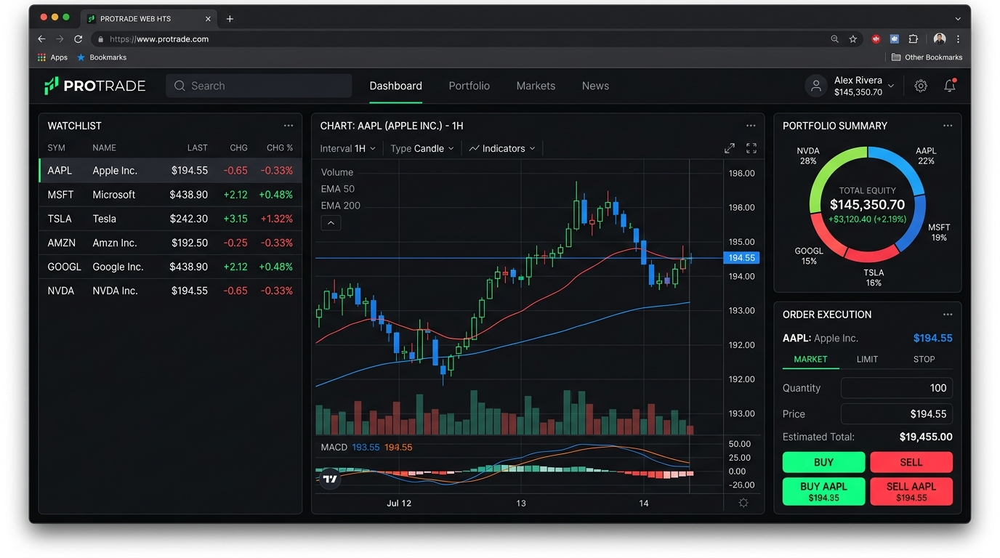
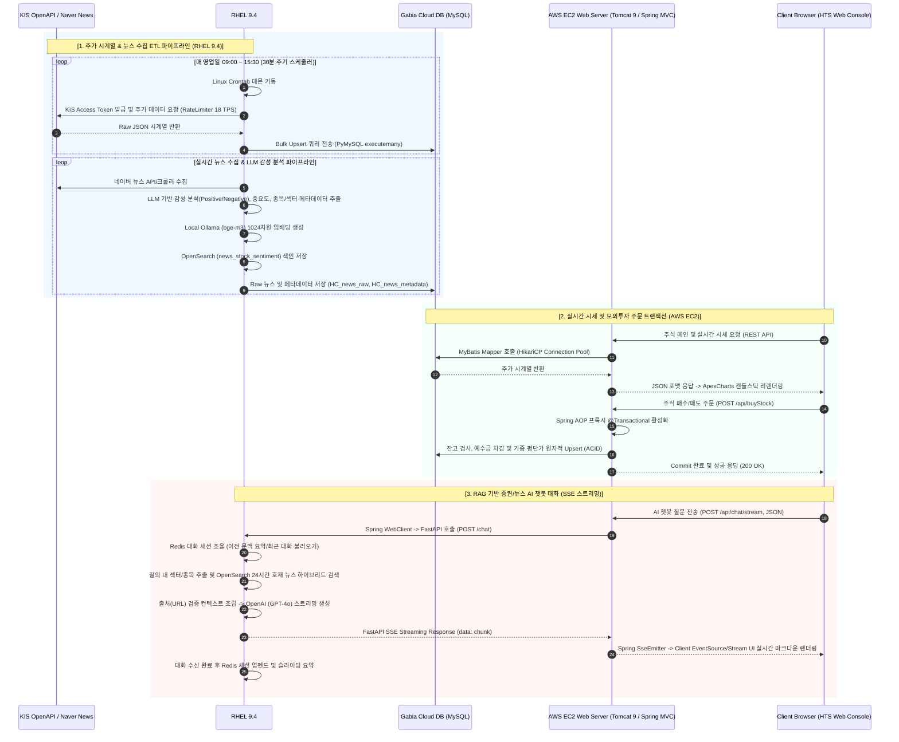

# 🐰 BLACKRABBIT HTS (Home Trading System) & RAG AI Financial Agent
> **한국투자증권(KIS) OpenAPI 기반의 실시간 시계열 ETL 파이프라인, RAG 기반 증권/뉴스 센티먼트 AI 챗봇, 그리고 3-Tier 4대 멀티 클라우드/서버 분산 인프라가 결합된 모의투자 HTS 웹 서비스**

본 프로젝트는 주식 시장의 실시간 가격 변동 데이터를 유실 없이 수집 및 분석하는 **ETL/RAG AI 분석 서버(학교 #116 RHEL 9.4)**, 데이터의 ACID 원자성과 영속성을 보장하는 **클라우드 데이터베이스(Gabia MySQL)**, 고성능 사용자 트랜잭션 및 웹 서비스를 담당하는 **애플리케이션 서버(AWS EC2 Java Spring MVC)**, 그리고 실시간 대화 문맥을 유지하는 **인메모리 세션 스토어(Redis)**를 통합 결합한 최첨단 엔지니어링 모델입니다.

---

## 📸 서비스 대시보드 (Service Dashboard Console)


*Tailwind CSS 기반의 금융 단말 특화 UI, ApexCharts 실시간 캔들스틱/도넛 포트폴리오 차트, 그리고 RAG 기반 증권/뉴스 감성 분석 AI 챗봇 위젯이 결합된 실시간 모의투자 단말 화면입니다.*

---

## 🏗️ 1. 엔지니어링 아키텍처 및 상세 데이터 흐름 (Data Flow Architecture)

시스템의 역할 분담 및 컴퓨팅 자원의 성능 효율성을 극대화하기 위해 **4대 분산 서버 아키텍처**를 구축했습니다:
1. **WAS Layer**: AWS EC2 (Java Spring MVC 5.3.6 / Tomcat 9 / HikariCP)
2. **Database Layer**: GABIA Cloud Server (MySQL 8.0 - 주가 시계열, 회원/보유 포트폴리오 원장, 뉴스 메타데이터)
3. **AI & Analysis Server**: 학교 116번 서버 (WSL2 / RHEL 9.4 - FastAPI, OpenSearch Vector Index, Local Ollama `bge-m3`, Redis, Python ETL)
4. **Client Layer**: HTS Web Console (JSP + Tailwind CSS + ApexCharts + SSE Streaming JS)



---

## 🛠️ 2. 기술 스택 상세 명세서 (Production Tech Stack Specs)

| 분류 | 적용 기술 | 선정 이유 및 상세 버전 |
| :--- | :--- | :--- |
| **Infrastructure** | **RHEL 9.4 (학교 #116)** | Red Hat Enterprise Linux 9.4 (WSL2 구축) 기반의 AI/분석 전용 고성능 노드 운영 |
| | **AWS EC2** | Tomcat 9 전용 인프라. 웹 애플리케이션 서비스의 99.9% 가용성 확보 |
| | **Gabia Cloud DB** | 고성능 MySQL 8.0 호스팅. 데이터 영속성 및 안정적 I/O 제공 |
| **AI & Search Engine**| **FastAPI 0.100+** | Python 기반 비동기(ASGI) AI 엔드포인트 및 SSE 스트리밍 서버 구현 |
| | **OpenSearch 2.x** | `bge-m3` 임베딩 벡터(`knn_vector`) + `term` 키워드 하이브리드 뉴스 검색 엔진 |
| | **Ollama** | 로컬 AI 데몬 기반 `bge-m3` 1024차원 뉴스/질의 벡터 임베딩 생성 |
| | **Redis 7.x** | 비동기 대화 세션 저장소 및 슬라이딩 윈도우 대화 컨텍스트 캐싱 |
| | **OpenAI API** | GPT-4o / GPT-4o-mini 기반 RAG 질의응답 및 감성 분석 LLM |
| **Backend WAS** | **Java OpenJDK 11** | G1GC 내장 및 JVM 메모리 관리 최적화 |
| | **Spring Framework 5.3.6** | Web MVC, Spring-JDBC, AOP 기반 선언적 트랜잭션(`@Transactional`) |
| | **Spring WebClient** | FastAPI AI 서버와의 비동기 넌블로킹(Non-blocking) SSE 스트리밍 연동 |
| | **MyBatis 3.5.19** | 금융 통계 쿼리 및 대량 Upsert 쿼리의 Java 코드 완전 분리 |
| | **Spring Security & JJWT**| BCrypt 단방향 암호화 (Work Factor 10) 및 JWT (Access/Refresh Token) |
| **ETL & Data Engine** | **Python 3.9 & Pandas** | KIS OpenAPI 시계열 수집, Sliding Window RateLimiter (18 TPS), 벌크 적재 |
| **Frontend** | **JSP & Tailwind CSS** | 다크 모드 금융 단말 특화 UI 및 SSE 스트리밍 챗봇 마크다운 위젯 UI |
| | **ApexCharts & JS** | ApexCharts 캔들스틱/도넛 차트 비동기 메모리 소멸/재성성 최적화 |

---

## 🗄️ 3. 데이터베이스 및 벡터/검색 인덱스 설계 (Data Modeling)

### 1) RDBMS 데이터베이스 스키마 (Gabia MySQL 8.0)

#### 📊 `HC_stock_master` (상장 종목 마스터)
*   **인덱스 튜닝**: `(ticker, status)` 복합 커버링 인덱스(Covering Index)를 생성하여 유효 종목 조회 시 디스크 I/O 완전 제거.

| 컬럼명 | 타입 | 제약조건 | Nullable | 설명 |
| :--- | :--- | :--- | :--- | :--- |
| `id` | INT | PRIMARY KEY AUTO_INCREMENT | NOT NULL | 순차 식별자 |
| `ticker` | VARCHAR(10) | UNIQUE KEY | NOT NULL | 주식 단축코드 (예: 005930) |
| `stock_name` | VARCHAR(100) | - | NOT NULL | 한글 종목명 |
| `market_type` | VARCHAR(10) | - | NOT NULL | KOSPI / KOSDAQ |
| `status` | VARCHAR(20) | INDEX | NOT NULL | ACTIVE (거래중) / DELISTED (상장폐지) |

#### 📊 `HC_stock_minute2` (1분 단위 주가 시계열)
*   **인덱스 튜닝**: `(ticker, stck_bsop_date, stck_cntg_hour)` 복합 UNIQUE KEY 설정을 통한 수집 데이터 중복 방지 및 시계열 검색 속도 극대화.

| 컬럼명 | 타입 | 제약조건 | Nullable | 설명 |
| :--- | :--- | :--- | :--- | :--- |
| `id` | BIGINT | PRIMARY KEY AUTO_INCREMENT | NOT NULL | 시계열 일련번호 |
| `ticker` | VARCHAR(10) | MULTI UNIQUE KEY (1) | NOT NULL | 종목 코드 |
| `stck_bsop_date`| DATE | MULTI UNIQUE KEY (2) | NOT NULL | 영업 일자 |
| `stck_cntg_hour`| TIME | MULTI UNIQUE KEY (3) | NOT NULL | 1분 봉 체결 시각 (HH:MM:SS) |
| `stck_oprc` / `stck_hgpr` / `stck_lwpr` / `stck_prpr` | INT | - | NOT NULL | 시가 / 고가 / 저가 / 종가 |
| `cntg_vol` / `acml_tr_pbmn` | BIGINT | - | NOT NULL | 체결 거래량 / 누적 거래대금 |

#### 📊 `HC_news_raw` & `HC_news_metadata` (뉴스 수집 및 LLM 메타데이터)
*   **의의**: 네이버 뉴스 API로 수집된 뉴스 원문과 LLM이 분류한 감성(Sentiment), 중요도(Importance), 종목/섹터 매핑 메타데이터 저장.

| 테이블 | 주요 컬럼 | 타입 | 설명 |
| :--- | :--- | :--- | :--- |
| `HC_news_raw` | `id`, `title`, `link`, `originallink`, `pub_date`, `source` | BIGINT, TEXT, VARCHAR... | 수집 뉴스 원본 정보 |
| `HC_news_metadata` | `id`, `news_id`, `ticker`, `matched_name`, `sector`, `sentiment`, `summary`, `importance` | BIGINT, VARCHAR, ENUM, TEXT... | LLM이 정제한 뉴스 분석 결과 |

---

### 2) Search & Vector Index 설계 (OpenSearch)

#### 🔍 `news_stock_sentiment` (OpenSearch Index)
RAG 질의 시 24시간 이내 호재 뉴스 및 섹터별 관련 정보를 고속 검색하기 위한 벡터-키워드 혼합 인덱스입니다.

```json
{
  "mappings": {
    "properties": {
      "news_id": { "type": "keyword" },
      "ticker": { "type": "keyword" },
      "matched_name": { "type": "keyword" },
      "sector": { "type": "keyword" },
      "sentiment": { "type": "keyword" },
      "importance": { "type": "integer" },
      "summary": { "type": "text" },
      "source_url": { "type": "keyword" },
      "published_at": { "type": "date" },
      "embedding": {
        "type": "knn_vector",
        "dimension": 1024,
        "method": {
          "name": "hnsw",
          "space_type": "cosinesimil",
          "engine": "nmslib"
        }
      }
    }
  }
}
```

---

## 🐍 4. Python ETL & RAG AI 분석 파이프라인 정밀 분석

### 1) RAG (Retrieval-Augmented Generation) AI 챗봇 알고리즘 ([chat_service.py](file:///F:/spring_dev/black_rabbit/Black_Rabbit/python/codeset/chatbot/chat_service.py))

*   **섹터/종목 자동 추출 및 하이브리드 필터링**:
    사용자 메시지에서 키워드를 파싱한 후, 최근 24시간 동안 수집된 호재(`sentiment: positive`) 뉴스를 OpenSearch에서 중요도(`importance` desc) 순으로 가져옵니다.

```python
# python/codeset/chatbot/chat_service.py L59-L78
async def search_sector_news(sector: str, hours: int = 24, size: int = 10):
    time_from = (datetime.now() - timedelta(hours=hours)).strftime("%Y-%m-%dT%H:%M:%S")

    query = {
        "query": {
            "bool": {
                "filter": [
                    {"term": {"sector": sector}},
                    {"term": {"sentiment": "positive"}},
                    {"range": {"published_at": {"gte": time_from}}}
                ]
            }
        },
        "sort": [{"importance": {"order": "desc"}}],
        "size": size
    }

    res = await os_client.search(index=INDEX_NAME, body=query)
    return [hit["_source"] for hit in res["hits"]["hits"]]
```

*   **환각 방지(Hallucination-free) 근거 링크 필터링**:
    LLM에 프롬프트를 전달할 때 **출처 URL (`source_url`)이 명확히 존재하는 기사만 컨텍스트로 구성**하여 존재하지 않는 기사를 지어내는 환각 현상을 근본적으로 차단했습니다.

```python
# python/codeset/chatbot/chat_service.py L90-L100
def build_answer_prompt(sector: str, grouped: dict, chat_summary: str) -> str:
    context_lines = []
    for stock_name, articles in grouped.items():
        for art in articles[:2]:  # 종목당 최대 2개 기사
            url = art.get("source_url") or ""
            if not url.strip():
                continue  # URL이 없는 기사는 환각 방지를 위해 제외
            context_lines.append(
                f"- [{stock_name}] {art['summary']} (출처: {art['source']} | {url})"
            )
```

*   **Redis 세션 관리 및 슬라이딩 컨텍스트 요약 ([redis_session.py](file:///F:/spring_dev/black_rabbit/Black_Rabbit/python/codeset/chatbot/redis_session.py))**:
    사용자 대화 세션 ID별로 대화 이력을 Redis에 저장하며, 대화가 6턴 이상 누적되면 이전 대화를 LLM으로 자동 요약하여 토큰 낭비를 줄이고 장기 문맥을 지속 보존합니다.

---

### 2) KIS 주가 시계열 수집 RateLimiter ([HC_stock_minute_all.py](file:///F:/spring_dev/black_rabbit/Black_Rabbit/python/codeset/HC_stock_minute_all.py))

*   **Sliding Window RateLimiter**: KIS OpenAPI의 18 TPS 한계를 준수하면서 `collections.deque` 타임스탬프 관리를 통해 정확히 1초 대기 슬롯을 제어합니다.

---

## ☕ 5. Spring MVC & FastAPI 스트리밍 아키텍처 (SSE Integration)

WAS(Spring MVC)와 AI 서버(FastAPI) 간의 실시간 스트리밍 데이터 연동은 `Spring WebClient`와 `SseEmitter`를 조합해 **비동기 넌블로킹(Non-blocking)**으로 처리됩니다.

### 1) Java Spring MVC SSE Controller & WebClient Service ([ChatServiceImpl.java](file:///F:/spring_dev/black_rabbit/Black_Rabbit/src/main/java/com/blackrabbit/chatbot/ChatServiceImpl.java))

```java
// src/main/java/com/blackrabbit/chatbot/ChatServiceImpl.java
@Service("ChatService")
public class ChatServiceImpl implements ChatService {

  @Resource private WebClient webClient;
  @Value("${fastapi.chat.url}") private String fastApiUrl;

  public void streamChat(String sessionId, String message, SseEmitter emitter) {
    Map<String, String> body = new HashMap<>();
    body.put("session_id", sessionId);
    body.put("message", message);

    webClient.method(HttpMethod.POST)
        .uri(fastApiUrl)
        .contentType(MediaType.APPLICATION_JSON)
        .accept(MediaType.valueOf("text/event-stream"))
        .bodyValue(body)
        .exchangeToFlux(response -> response.bodyToFlux(DataBuffer.class))
        .map(dataBuffer -> {
          byte[] bytes = new byte[dataBuffer.readableByteCount()];
          dataBuffer.read(bytes);
          DataBufferUtils.release(dataBuffer);
          return new String(bytes, StandardCharsets.UTF_8);
        })
        .doOnNext(chunk -> {
          try {
            String cleaned = chunk.replace("data: ", "").trim();
            if (cleaned.isEmpty()) return;
            if (cleaned.equals("[DONE]")) {
              emitter.complete();
              return;
            }
            emitter.send(SseEmitter.event().data(cleaned, MediaType.valueOf("text/plain;charset=UTF-8")));
          } catch (Exception e) {
            emitter.completeWithError(e);
          }
        })
        .doOnError(emitter::completeWithError)
        .doOnComplete(emitter::complete)
        .subscribe();
  }
}
```

---

### 2) 주문 트랜잭션 원자성(ACID) 제어 ([StockServiceImpl.java](file:///F:/spring_dev/black_rabbit/Black_Rabbit/src/main/java/com/blackrabbit/stock/StockServiceImpl.java))

모의투자 매수/매도 시 `@Transactional(rollbackFor = Exception.class)`을 통해 예수금 차감과 포트폴리오 가중 평균단가 연산이 하나의 물리적 트랜잭션 내에서 원자적으로 처리됩니다.

---

## 🎨 6. Frontend HTS UI/UX & AI 챗봇 마크다운 인터페이스

*   **다크 테마 트레이딩 콘솔**: `#050505` 배경과 `#0a0e17` 카드를 적용한 다크 테마.
*   **ApexCharts 메모리 최적화**: 캔들스틱 탭 전환 시 기존 차트 인스턴스 `.destroy()`를 명시적 실행하여 JS 메모리 누수 방지.
*   **실시간 마크다운 SSE 챗봇 위젯**: `chatbot.js`에서 SSE 스트림을 수신함과 동시에 실시간 마크다운 파싱 및 출처 링크 하이퍼링크 렌더링.

---

## 🚀 7. 3-Tier 분산 멀티 인프라 구축 및 운영 가이드 (Deployment Guide)

### 1) 학교 116번 서버 (RHEL 9.4 @ WSL2) - AI / 분석 / ETL 파이프라인 세팅

1. **필수 미들웨어 데몬 기동 (OpenSearch, Ollama, Redis)**:
   ```bash
   # OpenSearch 실행 (Port: 9200)
   sudo systemctl start opensearch
   
   # Ollama 서비스 기동 및 bge-m3 모델 다운로드
   ollama pull bge-m3
   
   # Redis 인메모리 서버 기동 (Port: 6379)
   sudo systemctl start redis
   ```

2. **Python 환경 설정 & FastAPI 백그라운드 구동**:
   ```bash
   cd /mnt/f/spring_dev/black_rabbit/Black_Rabbit/python
   conda create -n blackrabbit_env python=3.9 -y
   conda activate blackrabbit_env
   pip install -r requirements.txt
   
   # FastAPI RAG AI 챗봇 서버 구동 (Port 8000)
   nohup uvicorn codeset.chatbot.main:app --host 0.0.0.0 --port 8000 > chatbot_fastapi.log 2>&1 &
   ```

3. **Linux Crontab 수집 배치 자동 등록**:
   ```cron
   # 영업일 09:00 ~ 15:30 매 30분 마다 KIS 주가 1분봉 수집
   */30 9-15 * * 1-5 /root/miniconda3/envs/blackrabbit_env/bin/python /mnt/f/spring_dev/black_rabbit/Black_Rabbit/python/codeset/HC_stock_minute_all.py >> /tmp/cron_minute.log 2>&1
   
   # 네이버 뉴스 수집 및 LLM 메타데이터/OpenSearch 색인 파이프라인
   0 */2 * * * /root/miniconda3/envs/blackrabbit_env/bin/python /mnt/f/spring_dev/black_rabbit/Black_Rabbit/python/codeset/run_news_pipeline.py >> /tmp/cron_news.log 2>&1
   ```

---

### 2) AWS EC2 (Tomcat 9 WAS) 배포

1. **Maven WAR 파일 빌드**:
   ```bash
   mvn clean package
   ```
2. **EC2 전송 및 Tomcat 9 구동**:
   ```bash
   scp -i "your-aws-key.pem" target/blackrabbit.war ubuntu@<YOUR-EC2-IP>:~/
   sudo mv ~/blackrabbit.war /var/lib/tomcat9/webapps/
   sudo systemctl restart tomcat9
   ```

---

### 3) GABIA Cloud DB (MySQL 8.0) 접속 정보 주입

`src/main/resources/config/application.properties` 및 `python/dataset/config/.env`에 가비아 DB 접속 Endpoint, 사용자 계정, 비밀번호를 주입하여 각 아키텍처 레이어가 원격 데이터베이스와 통신하도록 설정합니다.
